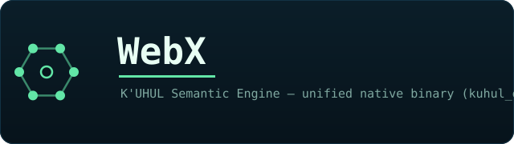

<p align="center"></p>

# WebX — K'UHUL Semantic Engine (`kuhul_engine`)

A unified native Windows binary for field-centric semantic compute: the K'UHUL
phase runtime (Pop → Wo → Yax → Sek → Ch'en → Xul), a CPU microkernel, GPU
trainer/compute (D3D11 / D3D12 / DirectML), the KXML runtime, an optical
processor, and the K'LHSL shader compiler — all built into a single
`kuhul_engine.exe`.

> **This repository is the minimal build.** It tracks only the `native/` engine
> source that `CMakeLists.txt` actually compiles, plus build config and docs.
> The example stacks, vendored trees, build output, and runtime state that live
> alongside it in development are intentionally **not** tracked (see `.gitignore`).
> `CMakeLists.txt` is the authoritative list of what makes up the system.

## What's here

| Path | Component |
|---|---|
| `native/pi_kuhul/` | K'UHUL Pi — CPU microkernel |
| `native/runtime/` | Phase sandbox (Pop → Wo → Yax → Sek → Ch'en → Xul) |
| `native/gpu_trainer/` | GPU trainer + compute (D3D11 / D3D12) |
| `native/kuhul_trainer/` | K'UHUL tensor (Tensor3D / Tensor8D) |
| `native/d3d12_compute/` | D3D12 compute + precompiled shaders |
| `native/kxml/` | KXML runtime |
| `native/optical_processor/` | Optical processor |
| `native/klsl/` | K'LHSL shader-language compiler |
| `native/geometry/`, `semantic_reader/`, `inference/`, `source/` | field mapping, law enforcement, model load/validate, `.kuhul` host |
| `native/shaders/` | HLSL / KLSL / WGSL (loaded & compiled at runtime) |
| `native/kuhul_engine.cpp` | canonical `main()` entry point |
| `CMakeLists.txt` | authoritative source list for the build |

## Build

Requires Visual Studio 2022 (x64) and the Windows 10 SDK (D3D11/12, DirectML, DXC).

```bat
mkdir build && cd build
cmake .. -G "Visual Studio 17 2022" -A x64
cmake --build . --config Release
bin\kuhul_engine.exe
```

The optional llama.cpp provider is auto-detected via `LLAMA_CPP_ROOT` (top of
`CMakeLists.txt`) and disabled if `llama.h` isn't found.

## GPU runtime

D3D11-primary (measured on Intel HD 4600: feature level 11_1, with D3D12 used
only as an 11_x bridge). DirectML provides hardware-accelerated GEMM; CPU /
OpenCL is the fallback. Shaders are loaded at runtime via `D3DCompiler_47.dll`
or precompiled offline.

## AtomicDOM shell

The station shell is manifest-bound (`native/runtime/atomic.*.manifest.json`) and
renders as native terminal frames — no browser CSS. It can present host-authoritative
feeds read-only; e.g. `atomic-shell <manifest> --sidecars` digitizes the XJSON
sidecar store into a SIDECARS block. Presentation surfaces never mutate host state.

## Related repositories

| Repo | What |
|---|---|
| [NNC-K](https://github.com/cannaseedus-bot/NNC-K) | runtime home — C# runtime, Micronauts, UI, K'UHUL |
| [WebX](https://github.com/cannaseedus-bot/WebX) | this repo — the `kuhul_engine` native binary |
| [XJSON](https://github.com/cannaseedus-bot/XJSON) | manifest-driven JSON object-server runtime + sidecar store |
| [Quantum](https://github.com/cannaseedus-bot/Quantum) | `quantum_trinity` candidate/compute sidecars |
